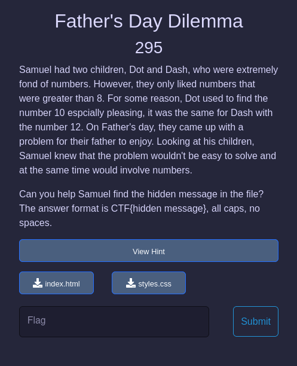
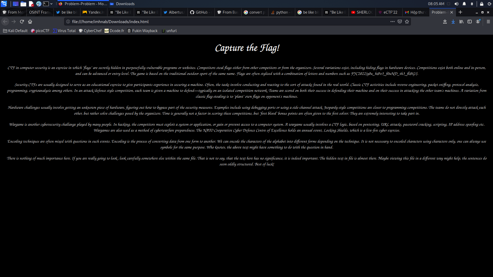
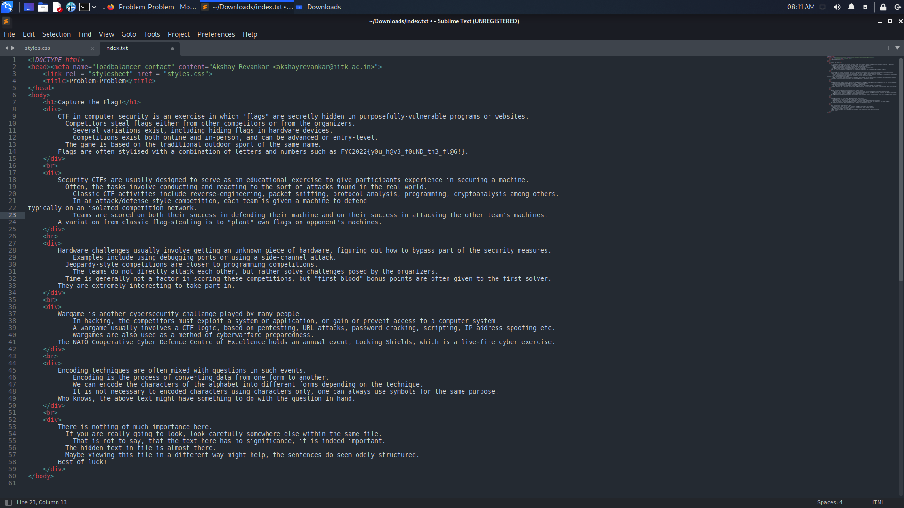
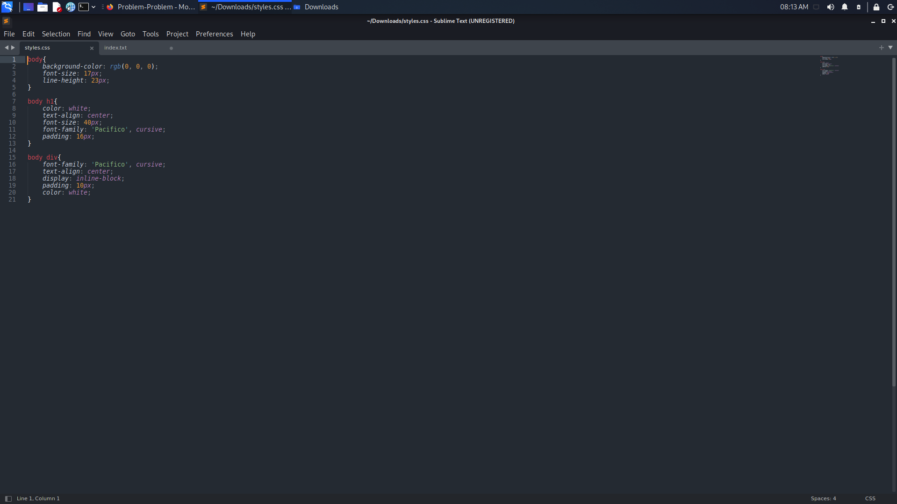

# Father's Day Dilemma
> This challenge requires competitors to have knowledge of mourse code!
- We have a description and two file : [index.html](index.html) and [styles.css](styles.css) as the picture: 

    

- Open [index.html](index.html) by a browser : 
  
    

- Open [index.html](index.html) by a text editor (I usually use Sublime Text) : 

    

- Open [styles.css](img/stylesbytexteditor.png) :
  
    

- Okay ! Nothing is special :D
- See to hint, we get some number always `larger than 8` and `10 = Dot(.)`, `12 = Dash(-)`. In that time, I had a idea related to `mourse code` but didn't have it.
- Try to read details in [index.html](index.html) and the last paragraph have something : 
    
    ```text
        There is nothing of much importance here. If you are really going to look, look carefully somewhere else within the same file. That is not to say, that the text here has no significance, it is indeed important. The hidden text in file is almost there. Maybe viewing this file in a different way might help, the sentences do seem oddly structured. Best of luck! 
    ```
    
- `look carefully somewhere else within the same file` and `the sentences do seem oddly structured` was hint in this challenge. 
- Hmm.... ! See a little bit to the form of paragraphs in [index.html](index.html) (opened by Text Editor) we can see number of the `Space` button before each sentences are : `8, 10 or 12`
- Let convert `Space` to `Dot(.)` and `Dash(-)` with value in hint, between paragraph we put `Space`! 
- After, have a text in mourse code form : `.--. .--- -.-. --- --- .-..` ==> Decoding mourse code to text, result : `PJCOOL`
  
- Flag : `CTF{PJCOOL}`