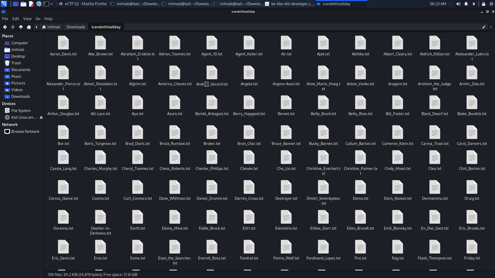

# I can do this all day.
> This challenge requires competitors to have knowledge of shell command line! 
- We have a file [icandothisallday.zip](icandothisallday.zip) with a description below : 

    

- After downloading and extracting we have a folder having many files with .txt extention :D

    

- Okay ! My task maybe find `flag` in somewhere among many text files @_@
- Because the `flag` has format : `CTF{...}` so I used a terminal script :
    
    ```text
        grep -i -r "CTF"
    ```

- Result :

    ```shell
        ┌──(imhnab㉿kali)-[~/Downloads/icandothisallday]
        └─$ grep -i -r "CTF"
        Pip_the_Troll.txt:Okay. Okay. Ready.CTF{d3cry471ng_nu3l34r_c0d35}               strings * | grep <word>         would've been faster 
    ```

- The result shows the text consisting of "CTF" in `Pip_the_Troll.txt` and content in this file is : 
  
    ```Okay. Okay. Ready.CTF{d3cry471ng_nu3l34r_c0d35}               strings * | grep <word>         would've been faster```

- Flag : `CTF{d3cry471ng_nu3l34r_c0d35}`