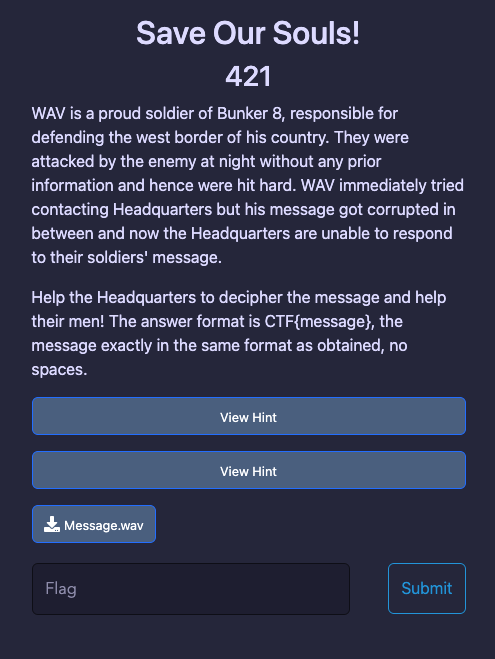
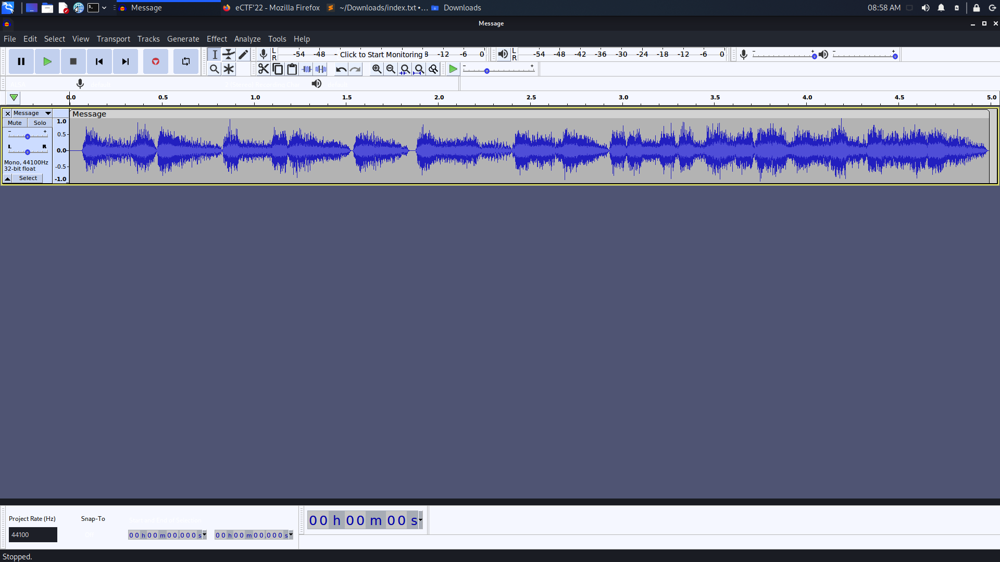
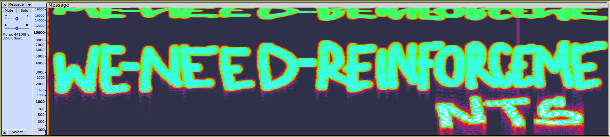

# Save Our Souls!
> This challenge requires competitors to have knowledge of sound forms and sound tools!
- We have a file [Message](Message.wav) with a description as the picture:
  
    

- After downloading, let check this file by command line : `file Message.wav`

    ```shell
        ┌──(imhnab㉿kali)-[~/Downloads]
        └─$ file Message.wav 
        Message.wav: data

    ```
    
- Hmm... This file has `.wav` extention (a sound or audio extention) but it's a data file :D
- Import it to `Audacity` with `Raw data` and default option: 

    

- Then convert from `Waveform` to `Spectrogram` and it should as below : 

    

- Flag : `CTF{WE-NEED-REINFORCEMENTS}`