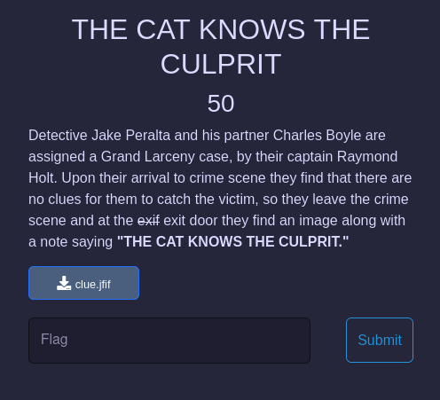

# THE CAT KNOWS THE CULPRIT
> This challenge is so easy UwU
- We have a file [clue.jfif](clue.jfif) with a description as a picture : 

    

- After downloading this file, check form of it : `file clue.jfif`

    ```shell
        ┌──(imhnab㉿kali)-[~/Downloads]
        └─$ file clue.jfif
        clue.jfif: JPEG image data, JFIF standard 1.01, aspect ratio, density 1x1, segment length 16, comment: "CTF{It_1s_D0UG_JUdY}", baseline, precision 8, 1400x1400, components 3

    ```

- Opps! We have the flag :D

- Flag : `CTF{It_1s_D0UG_JUdY}` 