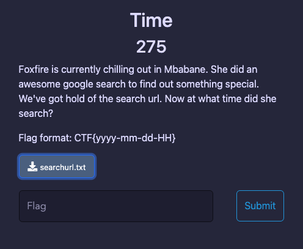

# Time
> This challenge take me lost a lot of time cause the different of time zone. :D
- We have a file [searchurl](searchurl.txt) with a description as the picture:

    

- Open [searchurl.txt](searchurl.txt) we should see a `URL` but it so long :3 
- We must find to `time` when this `URL` was searched.
- I use a [online tool](https://dfir.blog/unfurl/) to analyze this `URL`. 
- Find time and we had it : 

    

- Then spam time zones and had the flag.

- Flag : `CTF{2022-03-03-22}`
