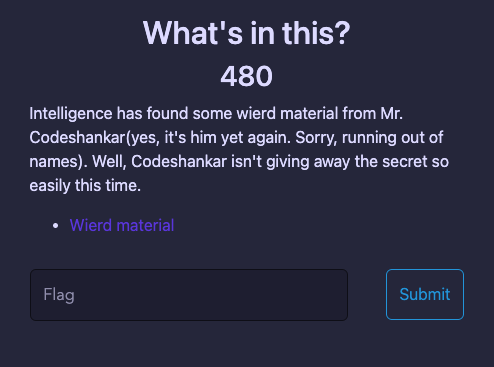

# Whatinthis
> This challenge is similar [Whatisthis](../Whatisthis/README.md) challenge
- We have a file [onion_garlic3.png](onion_garlic3.png) with a description as the picture:

    

- Check file format : `file onion_garlic3.png` like below :

    ```shell
        ┌──(imhnab㉿kali)-[~/Downloads]
        └─$ file  onion_garlic3.png 
        onion_garlic3.png: Zip archive data, at least v2.0 to extract, compression method=deflate

    ```

- This is a Zip file and we need to extact it!

    ```shell
        ┌──(imhnab㉿kali)-[~/Downloads]
        └─$ binwalk -e onion_garlic3.png 

        DECIMAL       HEXADECIMAL     DESCRIPTION
        --------------------------------------------------------------------------------
        0             0x0             Zip archive data, at least v2.0 to extract, uncompressed size: 79995392, name: onion_garlic3.tar
        29390463      0x1C0767F       End of Zip archive, footer length: 22

    ```

- From this step is similar [Whatisthis](../Whatisthis/README.md) challenge(You can read it!).
- Finally, I got the flag in file named `a.txt`

- Flag : `CTF{1t5_all_1n_l4yers}`

