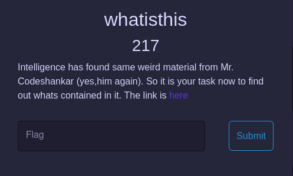
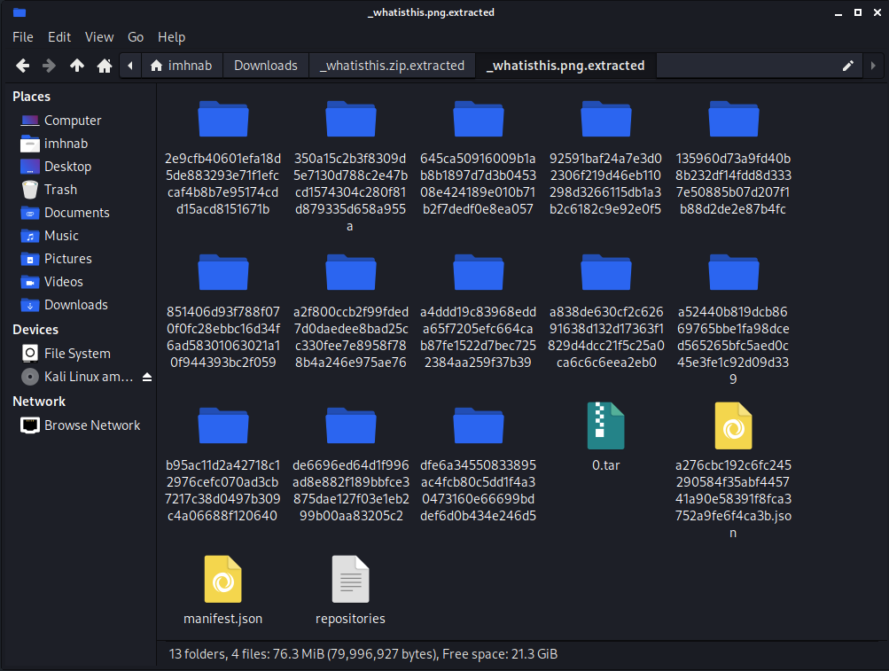

# Whatisthis
- We have a file [whatisthis.zip](whatisthis.zip) with a description as the picture : 

    

- After extracting this file, we have :

    

- Recursive files again :) . Use any tool scan `strings` and find the text has `"CTF"` and that so flag!
- The flag in a file named `nothing.txt` .

- Flag : `CTF{D0cker_ent3r5_the_p4rty}`