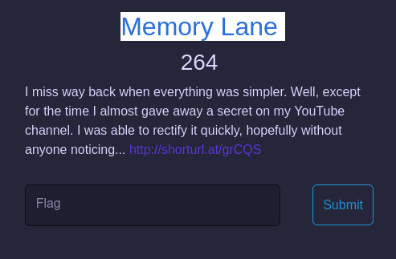
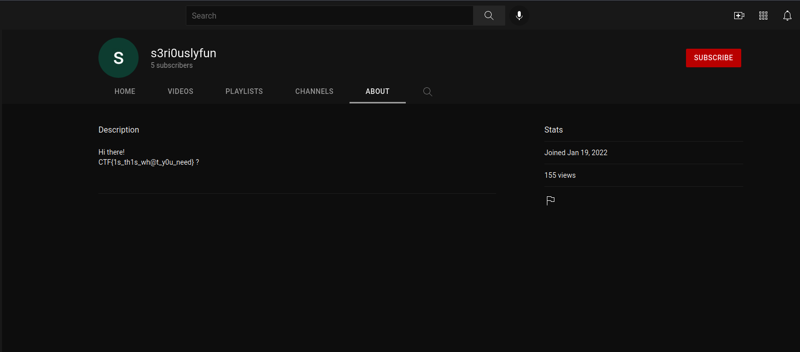
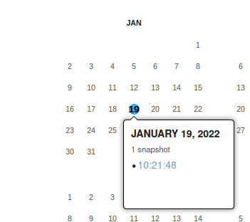
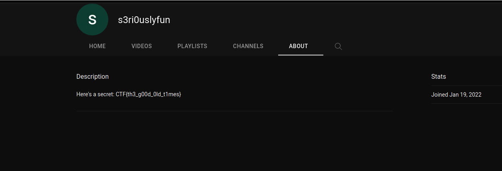

# Memory Lane
> This challenge requires `Wayback`
- We have a [link](http://shorturl.at/grCQS) with a description as the picture : 

    

- Click to link, a Youtube page appeared --> Click `About` and a fake flag showed :

    

- We need to back to history of this page to find the right flag. I use [The Wayback Machine](https://web.archive.org/) and there is a snapshot in `19-01-2022`:

    

- Go there.... And I have the real flag :D

    

- Flag : `CTF{th3_g00d_0ld_t1mes}`