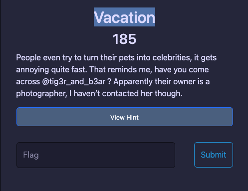
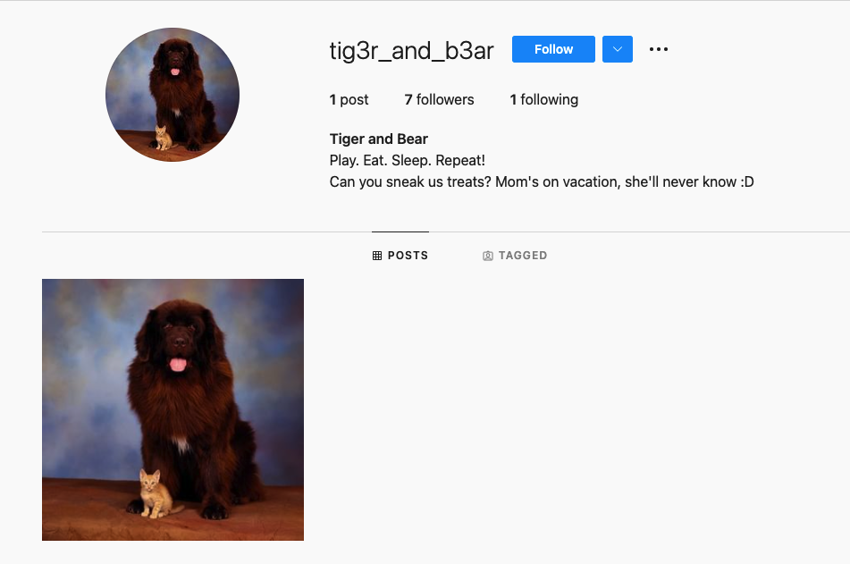
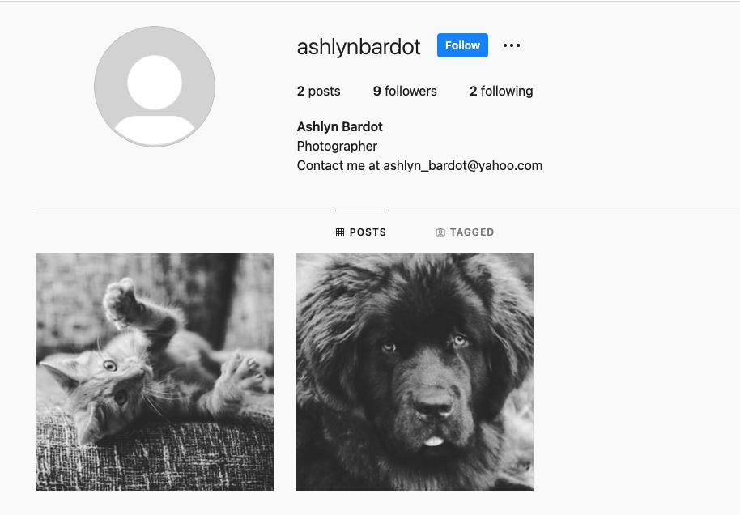
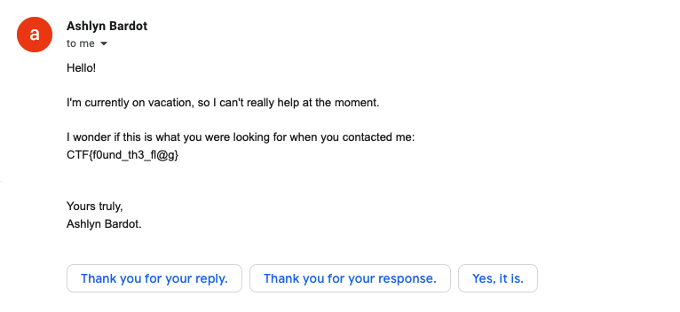

# Vacation 
> Osint 
- We have a description include `@tig3r_and_b3ar` as the picture:

    

- I found a Instagram account having username is `@tig3r_and_b3ar`, look at [this](https://www.instagram.com/tig3r_and_b3ar/):

    

- This account is following another named [ashlynbardot](https://www.instagram.com/ashlynbardot/) so I check it : 

    

- In bio, we should known that this person is owner of `@tig3r_and_b3ar`
- In hint : `Apparently their owner is a photographer, I haven’t contacted her though.` So I tried to contact with them by email in their bio `ashlyn_bardot@yahoo.com`
- The reply of that mail is flag, I got flag.

    

- Flag : `CTF{f0und_th3_fl@g}`