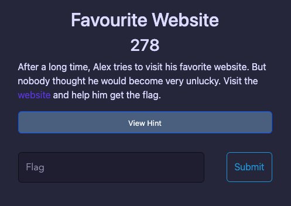
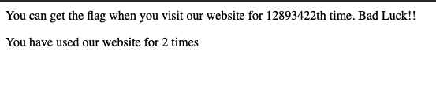
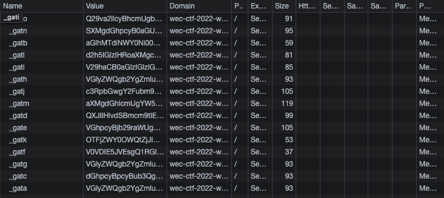
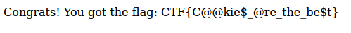

# Favourite Website  
> This challenge requires : `cookies`
- We have a [link](https://wec-ctf-2022-web.herokuapp.com/q2) with a description as the picture: 

    

- Click to link access a website, that show : 

    

- Each time you refresh or access this website the times of you `+1` --> You must refresh `12893422` time to access to `Favourite Website` (Bad Luck :D)
- To do that faster, we check to cookies and we have : 

    

- Decrypting each cookie to find more information, I found the cookie named `_gatj` that decrypted by `Base64` having result : 
    `still cannot solve this task?times=00000001&id573291-732b-4eaf-b419-6d1f907`
- So I tried fix `00000001` to `12893422` then encrypted it to `Base64` and it's `c3RpbGwgY2Fubm90IHNvbHZlIHRoaXMgdGFzaz90aW1lcz0xMjg5MzQyMiZpZDU3MzI5MS03MzJiLTRlYWYtYjQxOS02ZDFmOTA3`
- Input this value in cookies named `_gatj` and refresh website again. We have the flag!

    

- Flag : `CTF{C@@kie$_@re_the_be$t}`