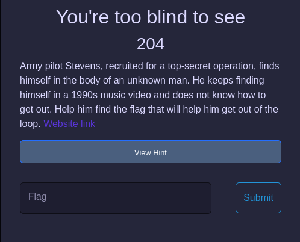
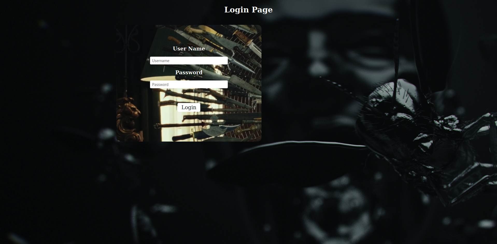
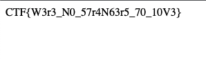

# You're too blind to see 
> This challenge requires : encrypt and decrypt `base64` and `Javascript`
- We have a [link](https://chinmayasharma-hue.github.io/CTF2022.gitbhub.io/) with a description as the picture :

    

- Click to [link](https://chinmayasharma-hue.github.io/CTF2022.gitbhub.io/) to connect a login page: 

    

- If you tried to login with wrong `username` and `password` you will link to the [RickRoll](https://www.youtube.com/watch?v=dQw4w9WgXcQ) :v 
- I tried to `F12` and i have this : 

    ```html
        <html>
        <!-- bmV2ZXJnb25uYWxldHlvdWRvd24wMTIyQGdtYWlsLmNvbSBrbm93cyB0aGUgcGFzc3dvcmQ -->
        <head>
            <title>Login Form</title>
            <link rel="stylesheet" href="css/style.css">
        </head>

        <script src="https://ajax.googleapis.com/ajax/libs/jquery/3.4.0/jquery.min.js"></script>
        <script src="https://cdnjs.cloudflare.com/ajax/libs/forge/0.8.2/forge.all.min.js"></script>

        <script type="text/Javascript">
            function generateHash(plainText) {
                var md = forge.md.sha256.create();
                md.start();
                md.update(plainText, "utf8");
                var hashText = md.digest().toHex();
                return hashText;
            }
            const loginForm = document.getElementById("login");
            const loginButton = document.getElementById("login-form-submit");

            function checkLogDetails() {
                var username = document.getElementById("Uname").value;
                var password = document.getElementById("Pass").value;
                if (username == "Rick Astley" && generateHash(password) == "1b638a7a9a56a4485ebd95816d1d8abf0576cdbf39854c6dd5cb47c3c53f48be") {
                    redirect_site = 'redirect'+ password + '.html';
                    window.open(redirect_site, '_blank');
                } else {
                    window.open('https://www.youtube.com/watch?v=dQw4w9WgXcQ');
                }
            }
        </script>

        <body>
            <h2>Login Page</h2>
            <div align="center" class='login'>
                <form id="login" method="get" onsubmit="checkLogDetails()">
                    <label><b>User Name
                        </b>
                    </label><br><br>
                    <input type="text" name="Uname" id="Uname" placeholder="Username">
                    <br><br>
                    <label>
                        <b>Password</b>
                    </label><br><br>
                    <input type="Password" name="Pass" id="Pass" placeholder="Password">
                    <br><br><br><br>
                    <input type="submit" value="Login" id="login-form-submit">
                    <br><br>
                </form>
            </div>
        </body>

        </html>
    ```

- We have a `Base64` script : `bmV2ZXJnb25uYWxldHlvdWRvd24wMTIyQGdtYWlsLmNvbSBrbm93cyB0aGUgcGFzc3dvcmQ` --> Decrypting it, Result : `nevergonnaletyoudown0122@gmail.com knows the password`.
- - I sent a email for that and they replied me a message : `never_gonna_say_goodbye` (this is correct password) !
- And see the `Javascript` : We can see :

    ```Javascript
        if (username == "Rick Astley" && generateHash(password) == "1b638a7a9a56a4485ebd95816d1d8abf0576cdbf39854c6dd5cb47c3c53f48be") {
                    redirect_site = 'redirect'+ password + '.html';
                    window.open(redirect_site, '_blank');
                } else {
                    window.open('https://www.youtube.com/watch?v=dQw4w9WgXcQ');
                }
    ```

--> The correct username is `Rick Astley`  

- Let login and have the flag!

    

- Flag : `CTF{W3r3_N0_57r4N63r5_70_10V3}`